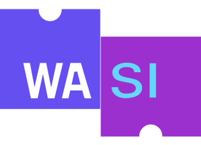

# webassembly-wasi-experiments

<p align="center"></p>

You may know WebAssembly, it's been around for a few years. Two years ago, I made a side project [topheman/rust-wasm-experiments](https://github.com/topheman/rust-wasm-experiments) to explain it to web developers with a more advanced example than the usual `add`/`substract` use case.

WebAssembly is moving beyond the browser, which means our code needs a way to talk to the system (to access resources like files, memory, network connections). This is [WASI : WebAssembly System Interface](https://hacks.mozilla.org/2019/03/standardizing-wasi-a-webassembly-system-interface/).

> All WASI is Wasm, but not all Wasm is WASI

## Goal

At the time I'm writing these lines, WASI is still very early. The resources and examples are scattered on the web. My goal is to give you a set of examples with the following constraints:

- real WASI use case (filesystem access), with source code originally written in both C and Rust:
  - [./c/c-app.c](./c/c-app.c): (compiled with clang using the [wasi-sdk](https://github.com/WebAssembly/wasi-sdk))
  - [./rust-app/src/main.rs](./rust-app/src/main.rs): (compiled with cargo/rustc, main compiler for rust)
- multiple runtimes and target languages:
  - node ([WASI Api behind flag](https://nodejs.org/api/wasi.html)) - [source code](./node)
  - [wasmtime](https://wasmtime.dev/) - A small and efficient runtime for WebAssembly & WASI
  - python (with [wasmer](https://github.com/wasmerio/wasmer)) - [source code](./python)
  - browser (with [wasmer](https://github.com/wasmerio/wasmer)) - [source code](./browser)

You will also find a [lot of resources](#resources) that I gathered while I was putting this project together.

## Summary

- [Prerequisites](#prerequisites)
- [Install](#install)
- [Run](#run)
- [Resources](#resources)
- [Author](#author)

## Prerequisites

You need to have installed:

- docker
- npm / node

## Install

```sh
git clone https://github.com/topheman/webassembly-wasi-experiments.git
cd webassembly-wasi-experiments
npm install
make init-docker
```

## Run

You will find two programs, one written in C ([source](./c/c-app.c)), an other written in Rust ([source](./rust-app/src/main.rs)), they both do the same thing: it is a command line interface that accepts any number of arguments and writes a `tmp.txt` file with those arguments, separated by line breaks.

A [Makefile](./Makefile) is available, at any moment you can run `make help` to get the help menu.

### Outside of the browser

For each program (c or rust), you can:

1. Build the `.wasm` file with `make docker-wasm-create-{c,rust}-app`
2. Then execute the generated `.wasm` file through one of the runtimes with:

- `make docker-run-wasmtime-{c,rust}-app`
- `make docker-run-python-{c,rust}-app`
- `make run-node-{c,rust}-app`

3. Those tasks will generate a `tmp.txt` file and output its content in the terminal. This file will have been created by the selected runtime which will have compiled the `.wasm` file compiled from C or Rust.

### Inside the browser

[Demo accessible online](https://topheman.github.io/webassembly-wasi-experiments/)

The build steps are the same as for outside the browser (since we use the same C/Rust program compiled in the same way to WebAssembly):

1. Build the `.wasm` file with `make docker-wasm-create-{c,rust}-app`
2. Then build the website files and launch the server with `npm start`

Go to http://localhost:5000 with Chrome or FireFox and try the demo in the browser.

You will find the same C/Rust programs compiled to WebAssembly running inside the browser through the wasmer runtime which emulates file system bindings.

## File system access

WASI will never let you access directly to files, directories, network sockets, and other resources that are identified by UNIX-like file descriptors.

You will have to tell your runtime which resources of the host you wish to access by declaring a `preopens` property - example:

The following config means that, when executed in the WASI runtime, the `/tmp` folder on the host machine will be available at `.` (current folder) in the wasm program (much like docker volume mapping).

```js
new WASI({
  preopens: {
    '.': '/tmp',
  },
});
```

More infos at: [Wasi Overview - Capability-Oriented](https://github.com/bytecodealliance/wasmtime/blob/main/docs/WASI-overview.md#capability-oriented)

## Resources

- Videos (WASI)
  - 📺 [Bringing WebAssembly outside the web with WASI by Lin Clark](https://www.youtube.com/watch?v=fh9WXPu0hw8)
  - 📺 [Lin Clark — WebAssembly: Building a new kind of ecosystem](https://www.youtube.com/watch?v=IBZFJzGnBoU)
  - 📺 [Rust, WebAssembly, and the future of Serverless by Steve Klabnik](https://www.youtube.com/watch?v=CMB6AlE1QuI)
  - 📺 [WebAssembly Threads - HTTP 203](https://www.youtube.com/watch?v=x9RP-M6q2Mg)
  - 📺 [Surma - Polyglot WebAssembly - View Source 2019](https://www.youtube.com/watch?v=vipTdFiy1uQ)
  - 📺 [WASM + React... Easily build video editing software with JS & FFmpeg](https://www.youtube.com/watch?v=-OTc0Ki7Sv0)
- More videos (WASM/WASI ...)
  - 📺 [Oh the things you’ll compile - modern WebAssembly (Chrome Dev Summit 2019)](https://www.youtube.com/watch?v=kZrl91SPSpc)
  - 📺 🇫🇷 [Utiliser WebAssembly, dès aujourd'hui - Christophe Rosset - ParisJS #86](https://www.youtube.com/watch?v=F3wOfWIFzVc&list=PLWhFHBFsRtquZ6hVXVjXmJ-l51ZXuSBtb)
  - 📺 [Debugging WebAssembly with modern tools](https://www.youtube.com/watch?v=VBMHswhun-s)
- Blog posts
  - [Standardizing WASI: A system interface to run WebAssembly outside the web](https://hacks.mozilla.org/2019/03/standardizing-wasi-a-webassembly-system-interface/) by Lin Clark on MDN
  - 🇫🇷 [Avec WASI, une interface système pour exécuter WebAssembly en dehors du Web](https://javascript.developpez.com/actu/253557/Avec-WASI-une-interface-systeme-pour-executer-WebAssembly-en-dehors-du-Web-Mozilla-voudrait-apporter-un-nouveau-standard-a-l-industrie/)
  - [WASI with wasmtime](https://sendilkumarn.com/blog/wasi-with-wasmtime/)
  - 🇫🇷 [Utilisation de l’API WASI dans Node.js](https://medium.com/@marchanin/utilisation-de-lapi-wasi-dans-node-js-e2cf3989e1e7)
  - [Compiling C to WebAssembly and Running It - without Emscripten](https://depth-first.com/articles/2019/10/16/compiling-c-to-webassembly-and-running-it-without-emscripten/)
- WebSites
  - [webassembly.org](https://webassembly.org)
  - [wasi.dev](https://wasi.dev/)
  - [NodeJS WASI API doc](https://nodejs.org/api/wasi.html)
  - [wasmtime.dev](https://wasmtime.dev/) - A small and efficient runtime for WebAssembly & WASI
    - [WASI overview](https://github.com/bytecodealliance/wasmtime/blob/main/docs/WASI-overview.md)
  - [wasmer](https://github.com/wasmerio/wasmer) - The leading WebAssembly Runtime supporting WASI and Emscripten
  - [wasm2wat demo](https://webassembly.github.io/wabt/demo/wasm2wat/) - WebAssembly has a text format and a binary format. This demo converts from the binary format to the text format.
  - [wasi-sdk](https://github.com/WebAssembly/wasi-sdk)
  - [wasi-libc](https://github.com/WebAssembly/wasi-libc)

## Author

[Christophe Rosset](https://github.com/topheman)
